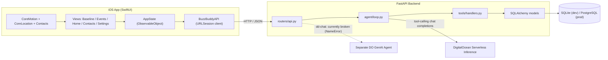

# BuzzBuddy

A personal check-in companion that compares how you're doing right now against how you do when you're sober — not a breathalyzer, not a BAC estimator, not a green light to drive.


BuzzBuddy is a SwiftUI iOS app backed by a FastAPI service. During a night out, it walks you through short reaction, balance, memory, and gait tests and hands the results to an agentic AI "e
xaminer" that compares them against a baseline you set while sober, then reports how confident it is that your performance has drifted — nothing more.

> **BuzzBuddy never tells you it's safe to drive.** It doesn't estimate blood alcohol content, diagnose impairment, or replace your own judgment. If there's any doubt, use a sober driver, ri
deshare, taxi, or public transit.

---

## Product preview

<!-- Add onboarding / Baseline-tab screenshot here -->
<!-- Add Home tab "Start Test" screenshot here -->
<!-- Add reaction/balance/memory test screenshots here -->
<!-- Add verdict screen screenshot here -->

No screenshots, GIFs, or App Store assets currently exist in this repository. See [Recommended repository improvements](#recommended-repository-improvements-not-part-of-this-readme) at the bottom for suggestions.

---

## Why BuzzBuddy?

Reaction time, balance, and memory all vary naturally from person to person, and from day to day for the same person — fatigue, stress, or a bad night's sleep can move the numbers as much as
 a drink can. A single generic "score" doesn't mean much on its own.

BuzzBuddy's premise is that comparing you to *your own* sober baseline is more meaningful than comparing you to a population average. It surfaces that comparison as a confidence level and a
plain-English explanation, so you have another data point when deciding what to do next — it doesn't make that decision for you, and it doesn't pretend to know your BAC or your legal status
to drive.

## How it works

1. **Set up your profile** on the Baseline tab — name, weight, height, and a designated-driver contact.
2. **Capture a sober baseline** for reaction time, balance, memory, and (optionally) gait, using the same test UIs used later for real check-ins.
3. **Add an event** (name, location, contact) on the Events tab.
4. **Start a check-in** from the Home tab — pick the event, and the AI examiner requests the first test.
5. **Take whichever test the examiner asks for.** After each result, it reveals its reasoning and either requests another test or reaches a verdict.
6. **See your results**: a CLEAR / MILDLY_IMPAIRED / SEVERELY_IMPAIRED label, a confidence percentage, a plain-language summary, and the full reasoning trail — plus a reminder that this is n
ot a driving-safety determination. From there, the app offers quick links to Uber, Waymo, or Zoox.

## Features

**Implemented**
- **Personal sober baseline** — reaction time, balance (gyroscope), memory recall, and gait, captured and re-tested from one Baseline tab (`BaselineView.swift`).
- **Reaction-time assessment** — tap-on-green-box test (`ReactionGame.swift`).
- **Motion-based balance assessment** — 5-second CoreMotion stability sample while standing on one leg (`GyroBalanceTestView.swift`).
- **Gait assessment** — 10-second CoreMotion walking capture, phone held against the chest (`GaitTestView.swift`, `MotionRecorder.swift`).
- **Memory assessment** — visual pattern-recall grid game across three rounds (`MemoryGame.swift`).
- **Adaptive check-in experience** — an agentic loop (FastAPI + DigitalOcean Serverless Inference tool calling) that retrieves the baseline, analyzes deviation, updates a confidence score, a
nd decides whether to request another test or conclude (`backend/app/agent/loop.py`).
- **Results dashboard** — verdict, confidence, AI summary, and a per-round reasoning log, revealed with a typewriter animation (`VerdictView.swift`, `SafetyCheckFlowView.swift`).
- **Event + contact management** — create events with a mapped location and a device contact, synced via the Contacts framework (`EventsView.swift`, `ContactsView.swift`).
- **Quick ride-hailing links** — deep links (with App Store fallback) to Uber, Waymo, and Zoox from the Contacts tab.
- **Safety-first copy** — the verdict screen and system prompt explicitly state BuzzBuddy does not estimate BAC or determine legal driving status.
- **Session resilience** — an in-progress check-in restores across app relaunch, and a backend that's forgotten a device (e.g. after a database reset) resets local state instead of showing a
 dead end.

**Partially implemented / currently broken**
- **Designated-driver notification.** The original design texted a DD via Twilio when impairment confidence crossed a threshold. The `notify_contact` tool, Twilio send logic, and the `dd_com
panion` module were removed in a later commit ("Remove the DD-contact notify path"), but the DD contact fields, Twilio settings, and the `notified`/"Automatically Call Emergency Contact" UI
remain in the codebase with nothing behind them.
- **DD companion chat.** `DDCompanionPreviewView.swift` and the `/sessions/{id}/dd-chat` endpoint exist, intended as a read-only Q&A for a designated driver. As of this writing, `backend/app
/routers/api.py` references `DDChatRequest`, `DDChatResponse`, and `ask_dd_companion`, none of which are defined or imported anywhere in the backend — **this currently raises a `NameError` o
n import and prevents the FastAPI app from starting at all.** See [Known issues](#known-issues).
- **DD contact capture is discarded server-side.** The iOS app sends `ddContacts` when creating a user, but the backend's `UserCreate` schema and `User` ORM model have no matching field — th
e value is silently dropped.
- **Settings tab** toggles (auto-call contact, sound effects) and biometric steppers are UI-only; none are persisted or connected to any backend behavior.
- **Orphaned prototype code.** `TestEngine`/`GameLibrary` (an earlier local, backend-less "shuffle 3 random games" prototype, still instantiated in `buzzbuddyApp.swift`), `GoNoGoGame.swift`,
 `TestFormView.swift`, `surveyForm.swift`, `testSessionView.swift`, and `MemoryRecallTestView.swift`/`MemoryRecallScoring.swift` (a digit-sequence memory test, superseded by `MemoryGame.swif
t`'s pattern grid) are still in the tree but not part of the live check-in flow.
- **`Core/Theme.swift`** is an empty stub with no content.

## Technology stack

| Layer | Technology | Purpose |
|---|---|---|
| iOS UI | SwiftUI, Swift 5.0, iOS 18.5+ (Xcode project) | App interface, all screens |
| iOS sensors | CoreMotion | Balance and gait sampling |
| iOS location | CoreLocation | Best-effort location attached to test submissions |
| iOS contacts | Contacts framework | Reading device contacts for events/DD selection |
| iOS maps | MapKit | Event location search and map preview |
| iOS persistence | UserDefaults (`Persistence.swift`) | Local IDs and cached baseline values |
| Backend API | FastAPI (Python 3.11) | HTTP routes, request/response models |
| Backend ORM | SQLAlchemy + Alembic | Data models and schema migrations |
| Backend database | SQLite (local dev) / PostgreSQL via `psycopg2-binary` (prod-capable, not provisioned) | Persistent storage |
| AI examiner | DigitalOcean Serverless Inference, OpenAI-compatible tool calling, model `anthropic-claude-4.6-sonnet` | Adaptive test sequencing and confidence scoring |
| DD companion agent | Separate DigitalOcean GenAI Agent (config present in `Settings`) | Intended Q&A for a designated driver — currently broken, see above |
| SMS (unused) | Twilio (`twilio` package, env vars present) | Was used for DD text alerts; the tool that called it has been removed |
| Deployment | Docker (`Dockerfile`), Gunicorn + Uvicorn worker | Built for DigitalOcean App Platform; not yet deployed |

## Architecture



## Repository structure

```
buzzbuddy/
├── AGENTS.md                    Contributor/agent notes (partially stale — verify against code)
├── backend/
│   ├── app/
│   │   ├── main.py               FastAPI app entrypoint
│   │   ├── config.py             Env-driven Settings (DB URL, DO key/model, Twilio, DD agent)
│   │   ├── database.py           SQLAlchemy session/engine
│   │   ├── schemas.py            Pydantic request/response models
│   │   ├── models/                ORM models: User, Baseline, Event, AgentSession, TestResult
│   │   ├── routers/api.py         HTTP routes (users, events, sessions, test-results, dd-chat)
│   │   └── agent/
│   │       ├── prompts.py          SYSTEM_PROMPT — the examiner's constraints and workflow
│   │       ├── client.py           DigitalOcean Serverless Inference client
│   │       └── loop.py             The tool-calling agent loop
│   │   └── tools/
│   │       ├── definitions.py       OpenAI-style tool schemas
│   │       └── handlers.py           Tool implementations
│   ├── alembic/                   Migrations (4 revisions; SQLite locally, swappable to Postgres)
│   ├── Dockerfile                 DigitalOcean App Platform image (Gunicorn, port 8080)
│   ├── requirements.txt
│   └── .env.example
└── ios/buzzbuddy/
    └── buzzbuddy/
        ├── buzzbuddyApp.swift      App entrypoint; also defines the unused TestEngine/GameLibrary
        ├── ContentView.swift        Wraps MainTabView, bootstraps AppState
        ├── MainTabView.swift        Custom 5-tab bar: Events, Contacts, Home, Baseline, Settings
        ├── App/
        │   ├── AppState.swift        App-wide state machine driving the check-in flow
        │   ├── Persistence.swift     UserDefaults-backed local storage
        │   └── LocationProvider.swift Best-effort one-shot location fetch
        ├── Features/
        │   ├── HomeView.swift        "Start Test" entry point into the check-in flow
        │   ├── EventsView.swift      Event list, map preview
        │   ├── AddEventView.swift    Create an event (location search + contact picker)
        │   ├── ContactsView.swift    Device contacts + ride-hailing quick links
        │   ├── BaselineView.swift    Profile setup + sober baseline capture/retest
        │   ├── SettingsView.swift    UI-only toggles/steppers, not yet wired up
        │   └── Testing/              Reaction/memory game views, incl. orphaned prototypes
        ├── Views/
        │   ├── SafetyCheckFlowView.swift  Routes AppState.phase to the right screen
        │   ├── StartEventView.swift        Pick an event to check in against
        │   ├── GyroBalanceTestView.swift    Balance test
        │   ├── VerdictView.swift            Final result screen
        │   ├── DDCompanionPreviewView.swift Preview chat UI for the (currently broken) DD companion
        │   └── OnboardingValidation.swift   Pure validation rules, unit-tested
        ├── Models/APIModels.swift    Codable structs mirroring backend/app/schemas.py
        ├── Networking/BuzzBuddyAPI.swift  HTTP client
        ├── Core/Theme.swift          Empty stub
        ├── buzzbuddyTests/            Unit tests (AppState, scoring, validation)
        └── buzzbuddyUITests/          Default Xcode UI test target
```

## Getting started

### Prerequisites

- macOS with Xcode (developed against Xcode 26 / Swift 5.0, iOS 18.5+ deployment target)
- Python 3.11
- A physical iPhone for meaningful balance/gait testing (see [Testing the app](#testing-the-app))

### 1. Clone the repository

```bash
git clone https://github.com/julianshekhtmeyster/buzzbuddy.git
cd buzzbuddy
```

### 2. Backend setup

```bash
cd backend
python3 -m venv .venv && source .venv/bin/activate
pip install -r requirements.txt
cp .env.example .env   # fill in DIGITAL_OCEAN_MODEL_ACCESS_KEY when you have it
alembic upgrade head    # creates buzzbuddy.db (SQLite) locally
uvicorn app.main:app --reload
```

> **Before you run this:** at the current HEAD, `backend/app/routers/api.py` references `DDChatRequest`, `DDChatResponse`, and `ask_dd_companion`, which are not defined anywhere in the backe
nd. Importing `app.main` raises a `NameError` and the server will not start until either those are implemented or the `/dd-chat` route is removed. See [Known issues](#known-issues).

Local dev works with zero external services beyond the DigitalOcean key — SQLite requires no setup. Without Twilio credentials, notifications degraded gracefully to a console log in earlier
versions, but the `notify_contact` tool itself has since been removed from the agent's tool list entirely.

### 3. iOS setup

1. Open `ios/buzzbuddy/buzzbuddy.xcodeproj` in Xcode.
2. Point the app at your backend:
   - In Debug builds, it defaults to `http://127.0.0.1:8000` automatically.
   - To target a different host, set the `BUZZBUDDY_API_BASE_URL` scheme environment variable, or add a `BuzzBuddyAPIBaseURL` key to Info.plist (required for Release builds — there's no fall
back).
3. Build and run on an iPhone simulator or physical device.

### Permissions

The app requests, via Info.plist usage-description keys already configured in the Xcode project:

- **Motion** (`NSMotionUsageDescription`) — for the balance and gait tests.
- **Contacts** (`NSContactsUsageDescription`) — to pick a designated-driver/event contact.
- **Location, When In Use** (`NSLocationWhenInUseUsageDescription`) — attached to test submissions; the description text mentions sharing location with a DD contact, but that delivery path i
s not currently implemented (see [Known issues](#known-issues)).

## Configuration

Set these in `backend/.env` (copy from `backend/.env.example`; gitignored, never commit real values):

| Variable | Required? | Description | Example |
|---|---|---|---|
| `DATABASE_URL` | No (defaults to SQLite) | SQLAlchemy connection string | `sqlite:///./buzzbuddy.db` |
| `DIGITAL_OCEAN_MODEL_ACCESS_KEY` | Yes, for the AI examiner to work | DigitalOcean Serverless Inference key ("All models" scope) | `your_api_key_here` |
| `DO_MODEL_NAME` | No (has a default) | Model identifier passed to the inference API | `anthropic-claude-4.6-sonnet` |
| `DO_BASE_URL` | No (has a default) | Base URL for the OpenAI-compatible inference endpoint | `https://inference.do-ai.run/v1/` |
| `TWILIO_ACCOUNT_SID` | No — currently unused | Present in `Settings` but no code path sends SMS anymore | `your-account-sid-here` |
| `TWILIO_API_KEY_SID` | No — currently unused | Same as above | `your-api-key-sid-here` |
| `TWILIO_API_KEY_SECRET` | No — currently unused | Same as above | `your-api-key-secret-here` |
| `TWILIO_FROM_NUMBER` | No — currently unused | Same as above | `+15555555555` |

Two additional settings exist in `backend/app/config.py` but are **not** in `.env.example` — add them manually if you work on the DD companion feature (which is currently broken regardless,
see below):

| Variable | Required? | Description |
|---|---|---|
| `DD_AGENT_ENDPOINT` | No | Endpoint for the separate DO GenAI Agent used by `/dd-chat` |
| `DD_AGENT_ACCESS_KEY` | No | Access key for that same agent |

On iOS, the backend URL is configured via the `BUZZBUDDY_API_BASE_URL` scheme environment variable or the `BuzzBuddyAPIBaseURL` Info.plist key (see [Getting started](#3-ios-setup)).

## Testing the app

- **Establishing a baseline:** open the Baseline tab, complete the profile fields, then run the reaction, balance, and memory tests (gait is optional — the backend column is nullable). The f
irst-ever baseline must submit reaction, balance, and memory together; retests after that submit independently.
- **Physical device required:** the balance and gait tests read live CoreMotion data. On a simulator (or a device with no motion hardware), they short-circuit to a neutral score (`1.0`) rath
er than blocking the flow — useful for click-through testing, not for a real baseline.
- **Reaction and memory tests** work fine in the simulator, since they're timer/tap-based rather than sensor-based.
- **Backend:** there are no automated backend tests in this repository. Exercise it manually with FastAPI's interactive docs at `http://127.0.0.1:8000/docs` once the server is running, or wi
th `curl` against the endpoints listed in [How it works](#how-it-works).
- **iOS unit tests:** `buzzbuddyTests/buzzbuddyTests.swift` has real Swift Testing coverage for `AppState` phase transitions, memory-recall scoring, and onboarding validation, run from Xcode
's Test navigator or `xcodebuild test`.
- **iOS UI tests:** `buzzbuddyUITests/` contains the default Xcode UI test template; no custom UI tests have been added.
- **Screenshot debug flags:** `BUZZBUDDY_DEBUG_PHASE` (`reviewing`, `verdict`, `game`) and `BUZZBUDDY_INITIAL_TAB` are Debug-only launch environment variables that seed a fake session so spe
cific screens can be reached without a live backend — useful for capturing screenshots.

## Safety and limitations

- BuzzBuddy does not measure or estimate blood alcohol content.
- Reaction, balance, memory, and gait tests cannot determine whether someone is legally impaired to drive.
- A "CLEAR" result does not mean it is safe to drive — alcohol can impair judgment even when someone believes, or tests as if, they performed normally.
- Confidence scores reflect deviation from a self-reported sober baseline, not a validated clinical or legal standard.
- When in doubt, don't drive — use a designated driver, rideshare, taxi, or public transportation instead.

## Current status

**Completed**
- FastAPI backend with SQLAlchemy models and 4 Alembic migrations
- Agentic examiner loop (`retrieve_baseline` → `analyze_deviation` → `update_confidence` → `request_test` or conclude) against DigitalOcean Serverless Inference
- SwiftUI app with 5 tabs: Events, Contacts, Home (check-in), Baseline, Settings
- Reaction, balance, memory, and gait test views, each reusable for both baseline capture and live check-ins
- Session persistence and restore across app relaunch
- Graceful reset when the backend no longer recognizes a cached user/event/session
- Unit tests for `AppState`, memory scoring, and form validation

**In progress / broken**
- `/dd-chat` endpoint and its schemas are undefined — the backend cannot currently start (see [Known issues](#known-issues))
- Designated-driver SMS notification was removed from the agent's tool list but its scaffolding (contact capture, Twilio config, UI toggle) remains, disconnected
- DD contact info entered on the Baseline tab is not persisted by the backend
- Settings tab is not wired to any backend or persisted state
- No Postgres instance provisioned; SQLite only
- Backend not deployed anywhere

**Planned** (inferred from in-repo TODO-style comments and partially-built scaffolding; not confirmed against an external roadmap)
- Restoring or removing the DD companion chat and DD notification paths
- Wiring the Settings tab to real persisted preferences
- Deciding the fate of the orphaned local-only game-shuffle prototype (`TestEngine`/`GameLibrary`) and duplicate memory-test implementation
- Provisioning Postgres and deploying the backend to DigitalOcean App Platform

## Roadmap

Based on what's scaffolded but incomplete in the repository:
- Fix or remove the `/dd-chat` endpoint so the backend can start
- Decide whether designated-driver notification returns (Twilio wiring exists but is disconnected) or is removed for good, including matching the `ddContacts` field on the backend
- Persist Settings-tab preferences
- Remove or finish the orphaned prototype views (`GoNoGoGame`, `TestFormView`, `surveyForm`, `testSessionView`, `MemoryRecallTestView`)
- Provision a managed Postgres database and deploy the backend (Docker image and DigitalOcean App Platform target already exist)
- Add automated backend tests

## Privacy

Based on the current implementation:

- **Profile information** (name, weight, height, BMI) is sent to and stored by the backend in plain form (`User` table).
- **Sober baseline test results** (reaction time, balance/gyro score, memory percentage, optional gait score) are stored server-side, unencrypted at the application layer (`Baseline` table).
- **Live check-in test results** and the AI's reasoning/confidence trail are stored per session (`TestResult`, `AgentSession.reasoning_log`, `AgentSession.conversation`) — the `conversation`
 column persists the full chat history sent to the AI provider, including prior reasoning.
- **Sensor data** (raw CoreMotion samples during balance/gait tests) is processed on-device to compute a single stability score; only that score, not the raw samples, is sent to the backend.
- **Location** is captured best-effort via CoreLocation and attached to test submissions (`AgentSession.latitude/longitude`) if granted; it is not currently transmitted anywhere beyond the b
ackend's own database.
- **Contacts** are read from the device's Contacts framework to populate event/DD pickers; contact data used for an event (name, phone, photo) is stored locally in a JSON file in the app's D
ocuments directory, not sent to the backend.
- **Designated-driver contact info** entered during onboarding is sent to the backend's `/users` endpoint but has no matching field in the backend schema or database — it is dropped, not sto
red.
- **AI requests** send baseline values, test results, and biometrics to DigitalOcean's Serverless Inference API (and, if repaired, a separate DO GenAI Agent for DD chat) as part of the tool-
calling conversation.
- No encryption, anonymization, or data-deletion mechanism is implemented in this repository beyond what SQLite/Postgres and the hosting platform provide by default. Do not assume data is en
crypted at rest or automatically deleted.

## Contributing

1. Fork the repository and create a branch off `main`.
2. Make your changes. For the backend, keep `backend/app/agent/prompts.py`'s constraints intact — per `AGENTS.md`, BuzzBuddy must never estimate BAC or state whether the user is legally safe
 to drive, and `notify_contact`-style escalation (if reintroduced) should stay a deliberately rare, high-confidence action.
3. Test your changes: run the relevant iOS unit tests (`xcodebuild test` or Xcode's Test navigator) and manually exercise any backend routes you touched via `/docs`.
4. Open a pull request describing what changed and why.

No enforced linter or formatter configuration was found in this repository; match the existing style in the file you're editing (SwiftUI views tend to favor small private subviews and comput
ed properties; the backend favors small, single-purpose handler functions).

## Team and acknowledgments

Commit history shows two contributors: `julianshekhtmeyster` and Max DeWeese (iOS feature work, per file headers). This repository's memory notes also reference Justin Kang as a contributor
driving the backend/agent flow. Only attribute contributions you can verify directly against `git log`/`git blame` for the current state of the code.

## License

No license file was found in this repository. Until one is added, all rights are reserved by default and the code should not be assumed to be open source.

---

### Information that could not be verified
- Whether the app has ever been run on a real device (no build/run logs in the repo)
- Full GitHub contributor list / profile links (only inferred from commit author names and file header comments)
- Any external roadmap, issue tracker, or design doc beyond what's inferable from code and commit messages
- Intended end-state of the DD notification/companion feature (removed for good vs. being rebuilt)

### Recommended repository improvements (not part of this README)
- Add real screenshots or a short demo GIF of onboarding, a check-in, and the verdict screen
- Fix or remove the `/dd-chat` endpoint so `uvicorn app.main:app` doesn't fail on import
- Add a `LICENSE` file
- Add automated backend tests (currently none)
- Remove or clearly quarantine the orphaned prototype files (`TestEngine`/`GameLibrary`, `GoNoGoGame`, `TestFormView`, `surveyForm.swift`, `testSessionView.swift`, `MemoryRecallTestView.swif
t`) so new contributors don't mistake them for the live flow
- Reconcile `AGENTS.md` (still describes the removed Twilio/DD-notify flow as current) with the actual code
